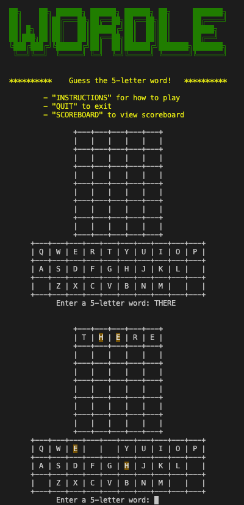
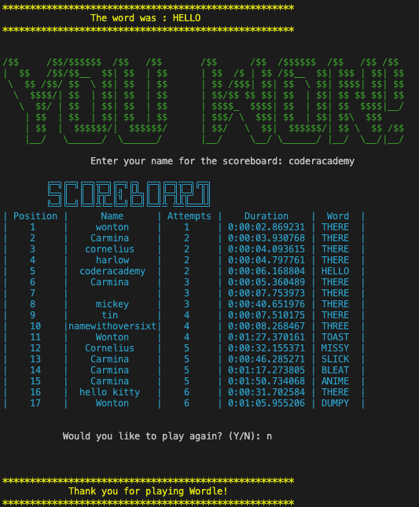
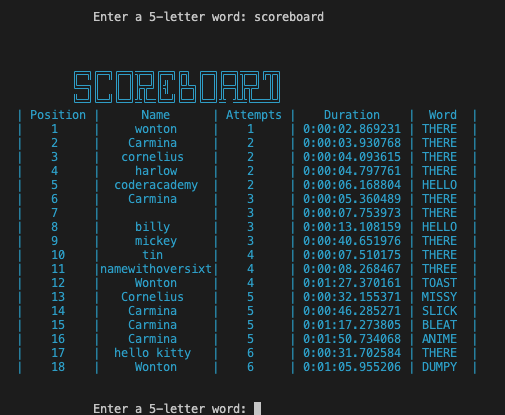
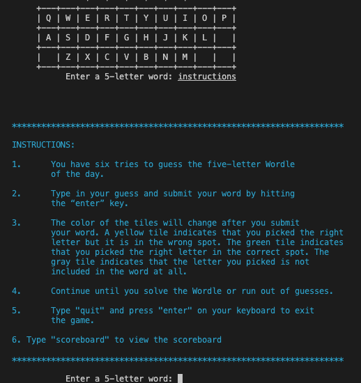
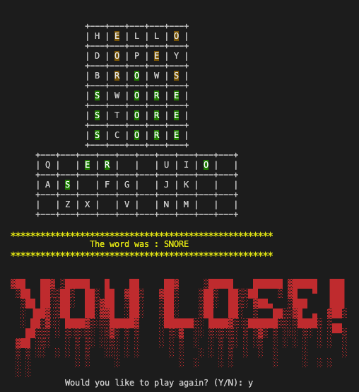

# Wordle

Github repository:  
https://github.com/CarminaF/Wordle

Walkthrough video:  
Submitted in README to Coder Academy 

##  Preview




## Purpose
This is a recreation of the New York Times' Wordle game as a terminal application written in Python 3. This was submitted for the T1A3 Coder Academy assignment.


## Technology
- Languages: Python 3 and bash script
- Project type: terminal application
- IDE: Visual Studio Code
- Package manager: pip
- Operating system requirement: Linux (MacOS or Unix)
- Programming paradigms: procedural/functional/imperative
- Styling standard: PEP8


## Requirements

A Linux-based operating system such as MacOS or Unix is required for this program. Python 3 is also required for this program to run which may or may not already be installed in your computer. Please also ensure pip is installed however, pip may already be installed in your computer with Python 3. 

### Check if Python 3 is installed:  

1. Enter the below in the terminal to check the python version installed:
    ```
    python -V
    ```
    The output should look something like this:
    ```
    Python 3.11.1
    ```
    NOTE: You may have both Python 2 and Python 3 installed in your computer. To check for specifically Python 3, enter the below in the terminal:
    ```
    python3 -V
    ```
2. If Python 3 is not installed on your computer, you can download it using this link: https://www.python.org/downloads/


### Check if pip is installed
1. Enter the below in the terminal to check the pip version installed:
    ```
    pip --version
    ```
    The output should look something like this:
    ```
    pip 23.1 from /Library/Frameworks/Python.framework/Versions/3.11/lib/python3.11/site-packages/pip (python 3.11)
    ```
2. If pip is not installed on your computer, please ensure you have the Python 3 installed: https://www.python.org/downloads/  

    You can also learn more about pip installation and upgrading here:  
    https://pip.pypa.io/en/stable/installation/ 

## Installation 

1. Select a program to run the Wordle game  
- For Visual Studio Code (VS Code):
    - Install VS Code if it is not already installed
    - Double click the icon to run VS Code
    - For MacOS, go to "Applications" then double-click "Utilities" then "Visual Studio Code"
    - Open the terminal using CTRL + `
- For Terminal on MacOS (already installed on Mac computers):
    - Go to "Applications" then double-click "Utilities" then "Terminal"
- For iTerm2 (this is not recommended, please see step 7.):
    - Go to "Applications" then double-click "Utilities" then "iTerm2"
    
    
2. Navigate to the directory you would like to install the program to:
- For VS Code:
    - Go to "File" then click "Open Folder"
    - Select the folder you want the Wordle source code/program to be saved to
- For Terminal or iTerm2 on MacOS:
    - Enter to the terminal the following to determine the current directory:
    ```
    pwd
    ```
    - Navigate to the desired folder as below:
    ```
    cd ./path/to/desired/folder
    ```

3. Enter the below in the terminal to clone the repository:
    ```
    git clone git@github.com:CarminaF/Wordle.git wordle
    ```
4. Navigate to the Wordle directory by typing the below to the terminal:
    ```
    cd wordle
    ```
5. Execute below start the Wordle program:
    ```
    ./run.sh
    ```
6. To exit the program at anytime, simply type "quit" and press enter

7. For best results, please use the Terminal application for MacOS or VS Code for MacOS or Unix. The program will still run when using iTerm2. However, during game play, the used incorrect letters in the Wordle program's keyboard will not be hidden as intended.

## Features

### Random Word Generator
- Utilizes random module to make a random word generator
- Word bank is initialized as one long multi-line string (copied from other word banks, see References below) then used the split function with \n as the delimiter at the end of the .py file
- Two word banks used both containing 5-letter words:
    - wordbank.py 
        - contains 2000+ common words 
        - Random module chooses from this list
    - valid_words.py 
       - contains 14000+ words including less common ones 
        - this is used to validate a user’s guess if they guessed an uncommon word but it will not be chosen as the word_to_guess
        - This makes it easier for the user to guess the word

### Grid Display

- 5 x 6 grid
- Empty row of squares when there are no guesses
- Each square populates with every letter in the user’s guess
- Each letter in the user’s guess is highlighted only once per occurrence in the word to guess
- Highlights letter:
    - Green when the correct letter is in the correct position
    - Yellow when the correct letter is in the wrong position
    - No colors on wrong letters

### Keyboard Display
- 10 x 3 grid imitating the QWERTY keyboard
- Squares contain every letter in the alphabet
- 4 squares are empty as there are only 26 letters in alphabet
- The squares are highlighted the same colors as grid.
- Once a letter is green, it will stay green even if letter in consequent guesses are in the wrong position (same logic as the original game)
- If letter was yellow, it will be overwritten as green if in the consequent guess it is in the correct position
- Wrong letters are hidden to allow user to guess the word better

### Scoreboard
- Entering “scoreboard” at anytime during game play will print the scoreboard
- User is then asked again if they want to enter a 5-letter word
- If they won, it will ask for their name to input to the scoreboard
- Scoreboard is sorted by the users having the least amount of attempts with  a shorter duration  being ranked higher at the top
- Name is truncated to have 16 letters max for spacing consistency

### Input
- Asks user for 5 letter word and same function used to ask user if they want to play again
- First trims white spaces and converts them to uppercase for consistency
- Throws error message if user has input non-alphabetic characters
- Checks if any commands are being entered
- Checks if the input has 5 letters only

The code to for validating the input is as below:
```python
def get_valid_input(purpose=""):
    while True:
        color = f"{MARGIN}{COLORS['red_font']}"
        reset = f"{COLORS['reset']}"

        if purpose == "ask_to_play_again":
            question = f"{MARGIN}Would you like to play again? (Y/N): "
            user_input = input(question)
        else:
            question = f"{MARGIN}Enter a 5-letter word: "
            user_input = input(question)
        print("\n")
        user_input = user_input.strip().upper()
        if not user_input.isalpha():
            message = "ERROR: Please enter alphabets only"
            print(color + message + reset)
        elif user_input == 'INSTRUCTIONS':
            print_instructions()
        elif user_input == 'SCOREBOARD':
            print_scoreboard()
        elif user_input.upper() == "QUIT":
            return user_input
        elif purpose == "ask_to_play_again":
            if user_input == "Y" or user_input == "YES":
                return True
            elif user_input == "N" or user_input == "NO":
                return False
            else:
                message = "ERROR: You must enter Y or N"
                print(color + message + reset)
        elif len(user_input) != 5:
            message = "ERROR: You must enter 5 letters"
            print(color + message + reset)
        elif (user_input.lower() not in VALID_WORDS and 
            user_input.lower() not in WORD_BANK):
            message = "ERROR: Not a valid word in the word bank"
            print(color + message + reset)
        else:
            return user_input
```
When entering "instructions" at anytime, the program will display the instructions:

### Fancy Text
Fancy colored texts are stored in the print.py and in scoreboard.py for the scoreboard. The colors utilise the colored module and the ASCII text art were generated from the following site: https://patorjk.com/software/taag/#p=display&f=Graffiti&t=Type 





### Scoreboard
- Entering “scoreboard” at anytime during game play will print the scoreboard
- The user is then asked again if they want to enter a 5-letter word
- If the user wins, it will ask for their name to input to the scoreboard
- Scoreboard is sorted by the users having the least amount of attempts with  a shorter duration  being ranked higher at the top
- Name is truncated to have 16 letters max for spacing consistency


## Testing
The testing for this application involves automatic and manual testing.

### Manual testing spreadsheet:
Link to manual testing spreadsheet:  
https://docs.google.com/spreadsheets/d/1Ixv0nXXOBi0LIbejPO5LQYAO3tF9AxpY7CBLLdf4b0A/edit?usp=sharing

### Automatic Testing:  
I programmed the following automatic tests:
- test_keyboard.py checks the get_alphabet_index() function in the keyboard module which is a necessary component to locate the index of the alphabet in the keyboard and this index will be used later to color in the keyboard at that index.
```python
from keyboard import get_keyboard_index

def test_get_keyboard_index():
    assert get_keyboard_index("Q") == (0, 0)
    assert get_keyboard_index("G") == (1, 4)
    assert get_keyboard_index("M") == (2, 7)

```
- test_main.py checks the check_guess() function. It returns a list of letters indicating the colour initial or dash '-' if it has no colour. This list returned is used later in the program to format the grid display.
```python
from main import check_guess
from colors import COLORS

def test_check_guess():
    test1 = ["-", "Y", "Y", "-", "-"]
    assert check_guess(user_guess="THERE", word_to_guess="HELLO") == test1
    test2 = ["G", "Y", "Y", "G", "-"]
    assert check_guess(user_guess="TREES", word_to_guess="THREE") == test2
    test3 = ["G", "G", "G", "G", "G"]
    assert check_guess(user_guess="HELLO", word_to_guess="HELLO") == test3
```

## Packages
This program uses the following packages for these purposes:
- random
    - To choose random word from word bank
- csv
    - To view and update the scoreboard
- Datetime  
    - To get the game time duration and display shorter duration higher in the scoreboard
- colored 1.4.4 (external)
    - Display color and background to the terminal
    - https://pypi.org/project/colored/
- pytest 7.3.1 (external)
    - For automatic testing
    - https://pypi.org/project/pytest123/ 


## References
- https://www.youtube.com/watch?v=mpH181-ches Text-Based Wordle in C under 25 Minutes! (Part 2 of 2)
- https://patorjk.com/software/taag/#p=display&f=Graffiti&t=Type%20Something%20 Text to ascii generator for the fancy fonts
- https://github.com/tabatkins/wordle-list word bank for valid words for users to use in their guesses (14855 words)
- https://gist.github.com/cfreshman/a7b776506c73284511034e63af1017ee word bank for actual answers containing more common words (2309 total)
- https://automatetheboringstuff.com/2e/chapter16/ how to write to csv files in Python
- https://pynative.com/python-timedelta/ 
- https://www.learnbyexample.org/python-sorted-function/ 
- https://www.programiz.com/python-programming/methods/built-in/sorted
- https://www.pythonchecker.com/ for PEP8 styling